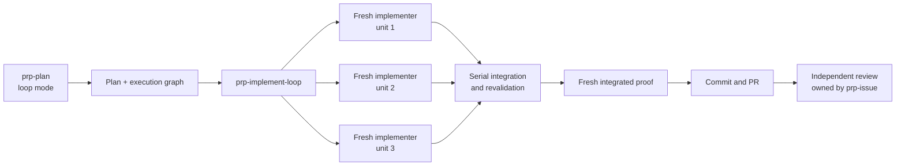

# Concept: Task-oriented PRP implementation loop

**Status:** Shelved for later experimentation

**Date:** 2026-08-20

## Idea

Large PRP plans can exhaust one implementation context even when their individual tasks are coherent and independently understandable. An optional implementation loop could treat the plan as a dependency graph of verifiable units, give each unit a fresh implementation context, and integrate their proven commits into one delivery.

This should complement—not replace—the current `prp-implement` path. Most plans have only a few tasks and do not justify another orchestration layer.

## Proposed shape

### Planning

Keep one owner for planning craft. Add a `loop` mode to `prp-plan` rather than duplicating investigation, product reasoning, first-principles design, and codebase research in a second planner skill.

The planner should establish the shared architecture, data shape, ownership, invariants, and acceptance criteria. Its execution units should remain more open-ended than today's implementation tasks so the implementer owns the simplest local solution instead of following a file-by-file prescription.

Each unit should carry only what survives a fresh context:

- observable outcome;
- dependencies;
- shared invariant and architectural constraints;
- integration and ownership surface;
- decisive codebase evidence;
- direct proof of completion;
- likely overlap with other units.

The planner proposes the dependency graph. The loop owns live scheduling because source state, conflicts, and available capacity may differ by execution time.

### Implementation

Start with an experimental, explicitly invoked `prp-implement-loop`. It acts as a mini-orchestrator and never implements product code itself.

For each ready unit:

1. Start a fresh task implementer.
2. Give it the complete plan, its assigned unit, repository instructions, live source, the current integration-head SHA, and the cumulative branch diff. The last commit alone is not authoritative context.
3. Let it choose the smallest implementation that preserves the plan's shared contract.
4. Require it to establish the before-state, implement the unit, prove the outcome directly, and produce one coherent green commit.
5. Verify the actual diff, commit, repository state, and proof rather than trusting the implementer's summary.

Independent units may run in parallel only in isolated branches and worktrees. Never let concurrent agents modify the same checkout. A blocked unit blocks its dependants; unrelated ready units may continue.

### Integration

Integrate completed units one commit at a time in dependency order. Re-run the unit's focused proof after integration because a result proven against an older parallel baseline is not proof against the accumulated branch.

Route semantic conflicts and cross-unit defects to an implementation context rather than resolving product code in the loop owner. After all units land, start a fresh integration agent to:

- prove every plan acceptance criterion against the cumulative branch;
- exercise the complete input-to-output path;
- find and correct cross-unit seams;
- commit any integration corrections;
- produce the final implementation report.

Then use the existing commit and PR skills. Independent review remains a later `prp-issue` phase rather than becoming part of the implementation loop.

## Verifiable-unit discipline

Use the smallest coherent unit that ends in an authoritative check. Do not advance a dependency from a broken base.

- Establish red-before-green evidence when behavior is being corrected, but keep each ordinary unit commit green. A deliberately failing test commit is useful only when the repository and delivery explicitly support that review shape.
- Treat “never batch” as a verification-boundary rule, not a per-file rule. A deterministic sweep or migration may be one unit when one repeatable check proves the whole transformation.
- Synchronize the integration branch with its real base once before execution. Parallel units branch from the latest verified integration checkpoint rather than independently rebasing throughout the run.
- Sequence commits so the delivery explains itself: subtraction before reshape, foundation before dependants, observable behavior before enrichment.
- Revalidate after every integrated commit, then prove the full outcome again at the end.

## Durable run state

Fresh contexts and parallel branches require one small, loop-maintained run artifact. Do not mutate the plan into a progress database.

| Unit | Depends on | Base SHA | Agent | Commit | Proof | Status |
|---|---|---|---|---|---|---|
| `{unit-id}` | `{ids or none}` | `{sha}` | `{run-local handle}` | `{sha or none}` | `{direct evidence}` | `pending \| running \| proven \| integrated \| blocked` |

The loop is the sole maintainer. The artifact must be recoverable from durable identities and live Git state rather than private summaries or remembered filenames.

## Ownership

| Concern | Owner |
|---|---|
| Product outcome, architecture, invariants, and proposed dependency graph | `prp-plan` loop mode |
| Unit scheduling, context creation, artifact verification, and terminal state | `prp-implement-loop` |
| One unit's implementation, proof, and commit | Task implementer agent |
| Cumulative validation and cross-unit correction | Fresh integration agent |
| Final implementation report, commit composition, and PR | `prp-implement-loop` through existing skills |
| Independent judgment and correction cycle | `prp-issue` and `prp-review` |

## Boundaries

- Do not replace `prp-implement` until real runs prove this is better for ordinary work.
- Do not parallelize units merely because capacity exists; use real dependency and overlap evidence.
- Do not create separate PRs per unit by default. A coherent commit stack inside one PR preserves the story without adding review and merge machinery.
- Do not add a second planning implementation. A loop-specific output mode may differ, but planning judgment stays with `prp-plan`.
- Do not let open-ended units reopen shared architectural decisions. The planner owns shared contracts; implementers own local mechanics.
- Do not add task indexes or another durable state system before the minimal run artifact proves insufficient.

## Questions to settle before building

1. What plan size or context pressure makes the loop preferable to normal `prp-implement`?
2. Should a normal plan be compilable into a loop graph, or should loop execution require the dedicated planning mode?
3. How should clean task commits be integrated across providers: cherry-pick by the loop owner, or by a dedicated integration agent?
4. How long should completed task contexts remain available for correction without exhausting agent capacity?
5. Which proof evidence belongs only in the run artifact, and which should survive in the final implementation report or PR?
6. Does an existing large Archon plan with 9–11 tasks complete faster or more reliably under this model than in one implementation context?

## Revisit when

Test the concept on one large, dependency-rich Archon plan after the current core workflow changes have settled. Compare it with ordinary `prp-implement` on completion time, context loss, integration defects, token use, and the usefulness of the resulting commit sequence. Promote it only if the additional orchestration produces materially better delivery rather than merely more visible activity.
